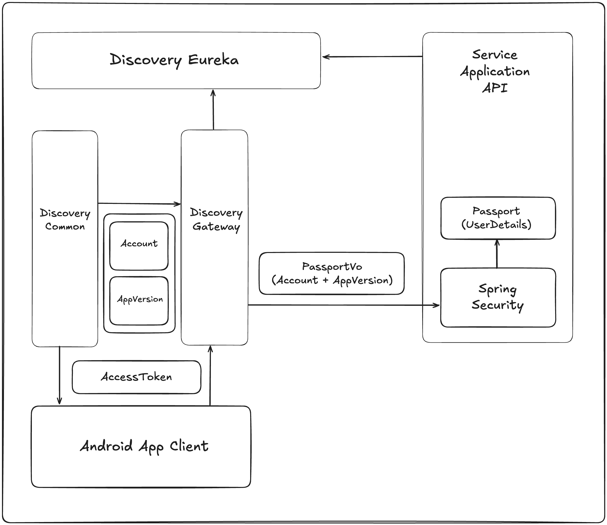

# 🚀 Monglife Discovery

서비스마다 필요한 공통적인 기능들을 구현한 프로젝트 입니다. 

## 🏗 Project Overview

### - Discovery App Eureka
- 모든 서비스의 로드 밸런싱 및 ```Feign Client```통신을 위해 사용되는 미들웨어 애플리케이션 입니다.

### - Discovery App Gateway
- 모든 서비스들의 요청을 받는 역할을 가진 애플리케이션 입니다.
- 모든 서비스는 같은 ```Gateway```를 거치고, 트래픽이 늘어나면 서비스마다 ```Gateway```를 두어 트래픽을 분산할 예정입니다.
- ```Gateway```에서 공통적으로 처리하는 기능
  - 하위 서비스로의 HTTP 요청 라우팅
  - 사용자 인증을 위해 ```AccessToken``` 의 유효성 검증합니다.
  - 하위 서비스에서 사용자를 인가하기 위한 ```PassportVo``` 를 생성합니다.
  - ```PassportVo```을 통해 ```Spring Security UserDetail```를 생성하여 사용자 인가에 사용됩니다.
    ```java
    /**
        PassportVo에 포함되는 사용자 계정 정보 Vo
    */
    public class PassportDataAccountVo {
        private Long accountId;
        private String deviceId;
        private String email;
        private String name;
        private String role;
    }
    
    /**
        PassportVo에 포함되는 사용자 기기 앱 정보 Vo
    */
    public class PassportDataAppVersionVo {
        private String appPackageName;
        private String buildVersion;
    }
    ```

### - Discovery App Common
- 모든 서비스의 ```로그인```,```로그아웃```,```모바일 기기정보```를 관리합니다.
- 모든 서비스의 ```Firebase Notification```을 ```Kafka```를 통해 요청을 받아 처리합니다.
- ```Discovery App Gateway```에서 ```PassportVo```를 생성하기 위한 ```사용자 계정 정보```,```사용자 기기 앱 정보```를 제공합니다.

## 🛠 System Architecture
