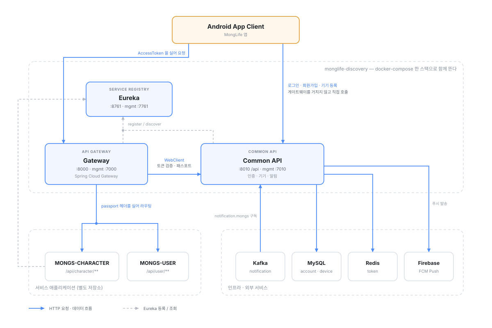
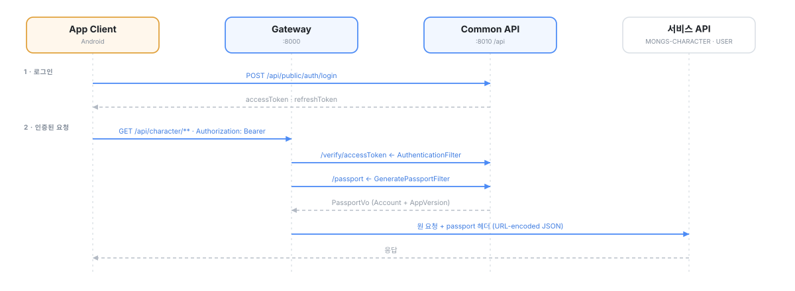

# 🚀 MongLife Discovery

MongLife 의 **디스커버리 백엔드**. 서비스 레지스트리(Eureka), API 게이트웨이, 그리고 모든 서비스가
공통으로 쓰는 인증·기기·알림 API 를 한 저장소에서 관리한다.

Java 17 / Spring Boot 3.1.1 / Spring Cloud 2022.0.3 / Gradle 8.5 멀티모듈.

---

## 🛠 System Architecture



### 인증 / 인가 흐름

게이트웨이는 토큰을 직접 해석하지 않는다. **검증과 패스포트 발급은 Common API 가 하고**,
게이트웨이는 그 결과를 `passport` 헤더에 실어 하위 서비스로 넘긴다. 하위 서비스는
`monglife-module-common-security` 의 `PassportFilter` 로 그 헤더를 읽어 Spring Security
`UserDetails` 를 만든다.



`PassportVo` 에 담기는 것:

```java
public class PassportDataAccountVo {      // 사용자 계정 정보
    private Long   accountId;
    private String deviceId;
    private String email;
    private String name;
    private String role;
}

public class PassportDataAppVersionVo {   // 사용자 기기 앱 정보
    private String appPackageName;
    private String buildVersion;
}
```

---

## 🏗 Project Overview

```
apps/
  monglife-discovery-app-eureka        서비스 레지스트리        :8761 (관리 :7761)
  monglife-discovery-app-gateway       API 게이트웨이           :8000 (관리 :7000, local·dev :7001)
  monglife-discovery-app-common-api    인증/알림/기기 API       :8010, context-path /api (관리 :7010)
domains/
  monglife-discovery-domain-account    계정·토큰·로그인이력 (MySQL + Redis)
  monglife-discovery-domain-device     기기·앱버전 (MySQL)
clients/
  monglife-discovery-client-fcm        Firebase Admin SDK 래퍼
configs/                               ← 설정 서브모듈 (private)
```

`apps` 만 실행 가능한 부트 jar 를 만든다(`bootJar`). `domains` / `clients` 는 라이브러리 jar 다.
공통 라이브러리(`monglife-core`, `monglife-module-common-*`)는 jitpack 에서 받고, 버전은 루트
`build.gradle` 의 `buildscript.ext` 에 모여 있다.

### Discovery App Eureka

- 모든 서비스의 등록·발견과 로드 밸런싱(`lb://`)을 담당하는 서비스 레지스트리.

### Discovery App Gateway

- 모든 서비스 요청의 단일 진입점. Spring Cloud Gateway(WebFlux) 기반.
- 라우팅 (`application-mongs.yml`)

  | route | predicate | 대상 | 필터 |
  |---|---|---|---|
  | `mongs-character` | `/api/character/**` | `lb://MONGS-CHARACTER` | AuthenticationFilter → GeneratePassportFilter |
  | `mongs-user` | `/api/user/**` | `lb://MONGS-USER` | AuthenticationFilter → GeneratePassportFilter |
  | `fallback` | `/common/**` | `lb://FALLBACK` | OldAppVersionFilter (구버전 앱 안내) |

- `AccessToken` 유효성 검증과 `PassportVo` 발급은 WebClient 로 `MONGLIFE-COMMON` 을 호출해 처리한다.
  **Common API 자체는 게이트웨이 라우트 대상이 아니다** — 클라이언트가 직접 호출한다.
- Resilience4j 서킷 브레이커(`application-circuitbreaker.yml`), 접근 로그(`AccessLoggingFilter`) 를 함께 둔다.

### Discovery App Common API

- 모든 서비스의 `회원가입` / `로그인` / `로그아웃` / `토큰 재발급` / `모바일 기기 정보` 를 관리한다.
- 게이트웨이가 `PassportVo` 를 만들 수 있도록 `사용자 계정 정보` / `사용자 기기 앱 정보` 를 제공한다.
- Kafka 토픽 `<프로파일>.notification.mongs` 를 구독해 FCM 푸시를 전송한다.

  | Method | Path (context-path `/api` 포함) | 설명 |
  |---|---|---|
  | POST | `/api/public/auth/join` · `/join/anonymous` · `/join/credential` | 회원가입 (일반 / 익명 / Google ID Token) |
  | POST | `/api/public/auth/login` · `/login/anonymous` · `/login/credential` | 로그인 |
  | POST | `/api/public/auth/logout` | 로그아웃 |
  | POST | `/api/public/auth/reissue` | 토큰 재발급 |
  | GET | `/api/public/auth/verify/version` | 앱 빌드 버전 검사 |
  | GET | `/api/public/auth/verify/accessToken` | 토큰 유효성 검증 (게이트웨이용) |
  | GET | `/api/public/auth/passport` | 패스포트 데이터 조회 (게이트웨이용) |
  | POST | `/api/public/userDevice` | 기기 등록 |
  | POST | `/api/admin/notification/mongs` | 알림 수동 발송 (ADMIN) |

- 인가 정책은 `SecurityConfig` 기준 `/public/**` permitAll, `/admin/**` ADMIN, 그 외 ADMIN·NORMAL.
- 레거시 경로(`/auth/**`, `/userDevice/**`)는 `RegercyAuthFilter` 가 `/public/**` 으로 재작성한다.

---

## ⚙️ 설정은 `configs` 서브모듈에서만 관리한다

> ⚠️ **이 저장소는 퍼블릭이다.** 비밀번호·키·토큰·접속 정보를 코드에도 문서에도 적지 않는다.

이 저장소에는 어떤 설정 파일(`*.yml`)도 두지 않는다. `*/src/main/resources/*.{yml,json,xml}` 은
**빌드 산출물**이고, 루트 `build.gradle` 의 `copyPrivate` 태스크가 서브모듈에서 복사해 만든다
(`.gitignore` 대상).

```
configs/properties/<parentModule>/<currentModule>/*.{yml,json,xml}
        │   copyPrivate: src/main/resources 의 기존 파일을 지우고 → 복사
        ▼
<currentModule>/src/main/resources/
```

프로파일은 `local` / `dev` / `stg` / `prd` 네 개다. **키를 추가하면 네 개 전부에 넣는다.**
상세한 규칙(파일 이름·프로파일·시크릿 취급)은 `configs/CLAUDE.md` 에 있다.

설정을 고칠 때는 순서가 있다. **2번을 빼먹으면 배포에 반영되지 않는다.**

```bash
# 1) 서브모듈에서 수정하고 커밋·푸시
cd configs && git add -A && git commit -m "..." && git push origin main && cd ..

# 2) 이 저장소에서 서브모듈 포인터를 커밋   ← 빼먹기 쉽다
git add configs && git commit -m "chore: configs 서브모듈 갱신"
```

---

## 🧰 빌드 / 테스트 / 실행

```bash
git clone --recurse-submodules https://github.com/MongLife/monglife-discovery.git

./gradlew copyPrivate                                        # 설정을 서브모듈에서 리소스로 복사
./gradlew :apps:monglife-discovery-app-common-api:build      # 빌드 + 테스트
./gradlew :apps:monglife-discovery-app-common-api:test
```

`copyPrivate` 는 CI/CD 가 빌드 전에 실행한다. 로컬에서 처음 빌드하거나 서브모듈을 갱신한 뒤에는
직접 한 번 돌려야 한다.

자바 버전은 `apps` / `domains` / `clients` 각 `build.gradle` 의 **toolchain(17)** 이 결정한다.
실행 JDK 가 21 이어도 17 바이트코드가 나온다 — 배포 이미지가 `eclipse-temurin:17-jre` 다.

테스트는 현재 `apps/monglife-discovery-app-common-api/src/test` 에만 있다. 다른 모듈에 테스트를
추가한다면 **그 모듈 `build.gradle` 에 `useJUnitPlatform()` 을 넣어야 한다.** 없으면
테스트가 0개 실행되고도 `BUILD SUCCESSFUL` 이 난다.

### 로컬 실행

`local` 프로파일은 외부 인프라 없이 뜨도록 되어 있다. DB 는 H2 인메모리이고 스키마는 엔티티에서
생성된다(`hbm2ddl: create-drop`). Kafka 는 원격을 쓴다.

**Redis 만 대체 불가하다.** `TokenEntity` 가 `@RedisHash` 이고 `RedisConfig` 가
`enableKeyspaceEvents = ON_STARTUP` 이라 기동 시점에 실제 연결이 필요하다. 비밀번호는
`configs/properties/domains/monglife-discovery-domain-account/domain-account.yml` 의 `local`
프로파일 값을 쓴다.

```bash
docker run -d --name monglife-local-redis -p 6379:6379 \
  redis:7-alpine redis-server --requirepass '<domain-account.yml 의 local redis password>'

./gradlew :apps:monglife-discovery-app-common-api:bootRun --args='--spring.profiles.active=local'
```

게이트웨이를 로컬에서 띄운다면 관리 포트가 **7001** 이다 — macOS 의 ControlCenter(AirPlay Receiver)
가 7000 을 점유한다.

---

## 🚢 브랜치와 배포

| 브랜치 | 워크플로 | 동작 |
|---|---|---|
| `develop` | `ci` | 세 모듈 빌드·테스트 (matrix) |
| `stage` | `cd-stg` | 빌드·테스트 → STAGE 서버 배포 |
| `release` | `cd-prd` | 빌드·테스트 → 운영 배포 |

워크플로 파일에는 **트리거와 job 배선만** 있고, 처리 과정은 composite action 에 모여 있다.
세 워크플로가 액션 둘을 공유하므로 **본문을 고칠 일이 있으면 액션을 고친다.**

```
.github/
  actions/
    ci/build-test/action.yml   빌드·테스트·JUnit 리포트·버전 추출·jar 업로드
    cd/deploy/action.yml       .version 생성 → 산출물 구성 → scp → service.sh up
  workflows/                   트리거와 job 배선만
    ci.yml  cd-stg.yml  cd-prd.yml
```

> ⚠ `.github/workflows/` 하위 폴더는 GitHub 이 읽지 않는다. composite action 은 경로 제약이 없어서
> `ci` / `cd` 분리를 `.github/actions/` 쪽에 두었다.

**파이프라인은 모듈별로 쪼개지 않는다.** 세 서비스가 `docker-compose.yml` 하나로 같이 뜨고
`service.sh up` 이 통째로 재기동해서 배포 단위가 하나이기 때문이다. 어느 모듈이 깨졌는지는
CI 의 matrix 로 갈라 보여 준다.

### CD (`cd-stg` / `cd-prd`)

두 job 이다. **`ci` 가 빌드·테스트하고 `deploy` 가 `needs: ci` 로 그 뒤에 붙는다.** 테스트가 깨지면
`deploy` 는 시작조차 하지 않아 서버에 SSH 로 붙기 전에 멈춘다. 빌드는 한 번만 하고, jar 세 개는
`discovery-jars` artifact 로 두 job 사이를 건넌다. 배포 시크릿(`HOST` / `SSH_KEY`)이 `deploy` 에만
노출되도록 `ci` job 에는 `environment` 를 걸지 않는다.

빌드 → `~/service/discovery` 로 전송 → 서버의 **`./service.sh up`** 호출이다. 워크플로가 compose 를
직접 부르지 않는다. 사전 검사(필수 키·로그 디렉터리·네트워크·jar 존재)와 기동 확인이 전부
`service.sh` 안에 있어서, 서버에서 손으로 돌릴 때도 같은 검사를 받는다.
**배포는 discovery 스택만 교체하고, 같은 서버의 나머지 스택은 손대지 않는다.**

```
/home/monglife/service/discovery/
  .env                       서버에서만 관리. 워크플로가 전송하지 않는다
  .compose                 ┐  스택 선언 (필수 키·네트워크·헬스체크)
  service.sh               │  기동 스크립트 (사전 검사 + 기동 확인)
  docker-compose.yml       ├ 워크플로가 매 배포마다 덮어쓴다
  spring-boot-docker-file  │
  .dockerignore            │
  .version                 ┘ 빌드한 모듈 버전
  build/monglife-discovery-app-{eureka,gateway,common-api}.jar
```

- 시크릿은 GitHub Environment(`stage` / `product`)에 둔다: `HOST` `PORT` `USERNAME` `SSH_KEY` `ACTION_TOKEN`.
- **`.env` 는 서버에서 손으로 만든다.** 워크플로도, 어떤 스크립트도 만들어 주지 않는다.
  저장소의 `configs/deploy/*/**/.env` 는 **참고용 사본**이라 서버와 갈라질 수 있다.
- **컨테이너에 넣는 환경변수 이름은 `UPPER_SNAKE` 로 쓴다.** 점이 들어간 이름(`db.host`)은
  ENTRYPOINT 의 `sh -c` 를 거치며 버려져 기동에 실패한다. `DB_HOST` 로 주면 스프링의
  relaxed binding 이 `${db.host}` 를 찾아준다.
- 네트워크는 전부 external 이고 서브넷을 `.compose` 에 고정한다. `service-net` 은 없으면 만들고,
  **`storage-net`(MySQL/Redis/Kafka)은 만들지 않고 없으면 중단한다.**
- `docker compose up -d` 는 컨테이너를 만들기만 하면 0 을 돌려준다. `service.sh` 가 `.compose` 의
  `STACK_HEALTH` 로 실제 기동을 확인하고, 실패하면 컨테이너 로그를 찍고 비정상 종료한다.

배포 순서는 **configs 푸시 → 서브모듈 포인터 커밋 → 코드 푸시** 다. 롤백할 때는 반대로
**코드부터** 되돌린다.

서버 트리의 상세와 조작법(`service.sh` / `.compose` 의 `STACK_*` 규칙 포함)은 `configs/CLAUDE.md`,
코드 작업 시의 함정은 루트 [`CLAUDE.md`](CLAUDE.md) 에 있다.

---

## 📦 기술 스택

| 영역 | 사용 |
|---|---|
| Language / Build | Java 17 (toolchain), Gradle 8.5 멀티모듈 |
| Framework | Spring Boot 3.1.1, Spring Cloud 2022.0.3 (Netflix Eureka, Gateway, Resilience4j) |
| Persistence | Spring Data JPA + QueryDSL 5.0, MySQL (운영) / H2 (local), Redis (토큰) |
| Messaging | Kafka (`monglife-module-common-kafka`) |
| Auth | JJWT 0.11.5, Google API Client (ID Token), Spring Security (`monglife-module-common-security`) |
| Push | Firebase Admin SDK 9.2.0 |
| Observability | Actuator + Micrometer Prometheus, Logstash Logback Encoder (ELK) |
| Deploy | Docker Compose, GitHub Actions (composite action) |
